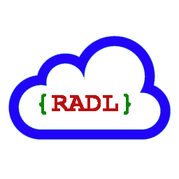

# RADL  #

* [What is RADL?](#What_is_RADL)
* [How can I get RADL?](#How_can_I_get_RADL)
  * [Downloading built artifacts](#Downloading_built_artifacts)  
  * [Building from Source Code](#Building_from_Source_Code)
* [How do I use RADL?](#How_do_I_use_RADL)
  * [Using RADL with Gradle](#Using_RADL_with_Gradle)
  * [Using RADL with Java](#Using_RADL_with_Java)
  * [Using RADL with Maven](#Using_RADL_with_Maven)
* [License](#License)




## <a name="What_is_RADL"/> What is RADL? ##

*RESTful API Description Language* (RADL) is an XML vocabulary for
describing Hypermedia-driven RESTful APIs.  Unlike most HTTP API description languages, RADL focuses on defining a truly hypermedia-driven REST API from the client's point of view. Unlike description languages based on JSON or Markdown, RADL makes it easy to integrate documentation written in HTML or XML. The APIs that RADL describes may use any media type, in XML, JSON, HTML, or any other format.

RADL can be used to:

* Design a RESTful API
* Validate an API description for consistency
* Generate documentation from an API description
* Generate Spring Framework Java controller classes from an API description (for design-first environments)
* Generate the resource model for a RESTful API from Spring Framework Java controller classes (for code-first environments)

> *NOTE* - RADL does not yet support Node.js or non-Java environments, and we have not yet defined a timeline for doing so. If you need support for a particular environment in RADL, please contact the authors - we welcome contributed code to support such environments.

RADL describes both the hypermedia client API and the resource model, which describes the implementation and should not be exposed to the client. In a REST API, the server provides options to a client in the form of hyperlinks in documents, and the main thing a client needs to know is how to locate and use these links in order to use the API.  In RADL, the client API is defined in terms of client states, link relations, media types, URI parameters, and any custom headers or status codes that need to be documented.  The resource model is defined in terms of resources, their locations, the HTTP methods that can be applied to them, and the conventions for using those methods.  The resource model corresponds roughly to the information found in Swagger or RAML. In documentation generated by RADL, the interfaces associated with each client state are assembled from the client API description and the resource model.

##  <a name="How_can_I_get_RADL"/> How can I get RADL? ##

### <a name="Downloading_built_artifacts"/> Downloading built artifacts ###

If you do not need source code, the easiest way to get RADL is to download pre-built binaries from [Bintray.com / radl](https://bintray.com/radl/RADL):

[  ](https://bintray.com/radl/RADL/radl-core/_latestVersion)

## <a name="Building_from_Source_Code"/> Building from Source Code

First, get the code:

```
$ git clone https://github.com/restful-api-description-language/RADL
```

Then run `./gradlew`. This will build jar files in the `build/libs/` directories of the modules.

##  <a name="How_do_I_use_RADL"/> How do I use RADL?

### <a name="Using_RADL_with_Gradle"/> Using RADL with Gradle ####

The easiest way to use the RADL tools is through a [Gradle](http://www.gradle.org/) build script.
Add the following to your `build.gradle`:

    buildscript {
      repositories {
        jcenter()
      }
      classpath "radl:radl-gradle:$radlGradleVersion"
    }

Also add this to your `gradle.properties`:

    radlGradleVersion = 1.0.0

Alternatively, you can download the plug-in:

[  ](https://bintray.com/radl/RADL/radl-gradle/_latestVersion)


The plug-in will add several tasks to your build to work with RADL files:

* `validateRadl`: Validates RADL, reporting issues in [CheckStyle](http://checkstyle.sourceforge.net/) format
* `generateDocumentationFromRadl`: Generates HTML documentation from RADL
* `radl2server`: Generates Spring server code from RADL
* `extractRadlFromCode`: Extracts RADL from JAX-RS or Spring code

You can execute these tasks directly from the command-line, or make other tasks depend on them.

### <a name="Using_RADL_with_Java"/> Using RADL with Java ####

You can also run `java <radlClass>`. There is a corresponding Java class
for each Gradle task mentioned above:

* `radl.core.validation.RadlValidator`
* `radl.core.documentation.DocumentationGenerator`
* `radl.java.generation.spring.RadlToSpringServer`
* `radl.java.extraction.FromJavaRadlExtractor`

> *NOTE* - all dependencies must be on the CLASSPATH.

### <a name="Using_RADL_with_Maven"/> Using RADL with Maven ####

A Maven plug-in is on the roadmap. For now, you can use
[exec-maven-plugin](http://mojo.codehaus.org/exec-maven-plugin/java-mojo.html) to run the
Java classes mentioned above.


## <a name="License"/> License ##

Copyright © EMC Corporation. All rights reserved. EMC grants rights under the Apache 2.0 license.
See the `LICENSE` file for more information.
